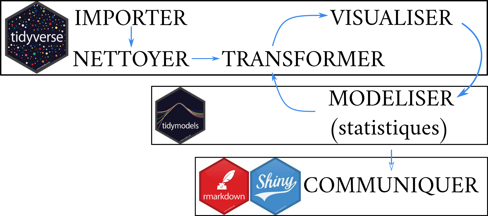
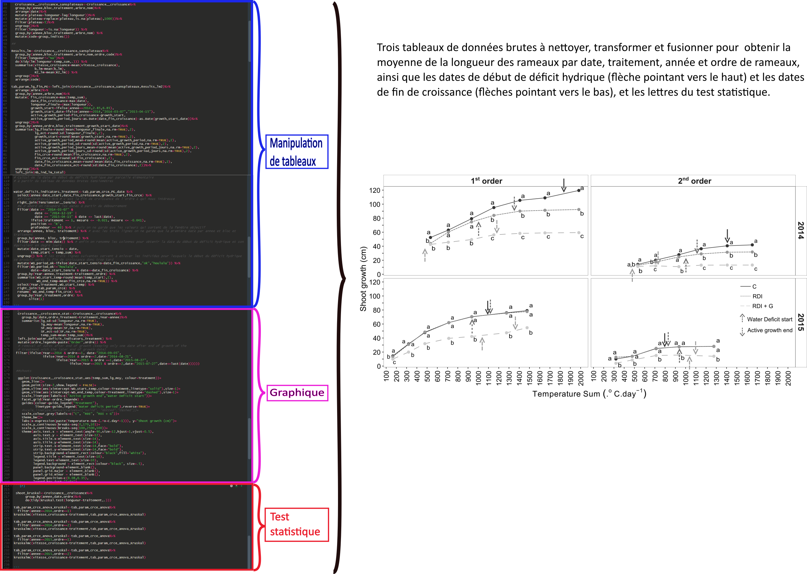
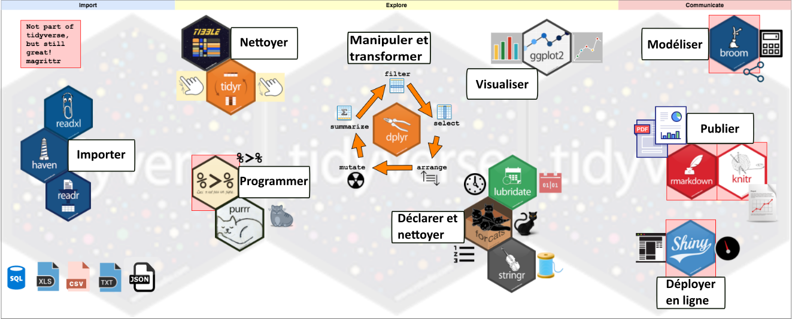

# Objectifs

::: {align="justify"}

L'objectif de ce cycle de formations est de permettre aux chercheur-se-s
en sciences expérimentales d'acquérir les bases du fonctionnement du
logiciel RStudio, du Tidyverse et de Rmarkdown pour l'analyse de données
(manipulation de tableaux, production de graphiques, démarche de
l'analyse statistique) et la production de rapports. L'objectif
opérationnel est de permettre la production de résultats publiables avec
un logiciel de programmation et un outil unique, afin d'appliquer une
démarche qualité (transparence et reproductibilité) à l'analyse de
données et d'être en mesure de fournir aux éditeurs le code
reproductible qui a généré les résultats à publier. Ce cycle de
formations se concentre principalement sur les étapes de l'analyse de
données en amont de l'analyse statistique (manipulation de tableaux,
graphiques) et a l'originalité d'être <strong>entièrement basée sur le
package et langage Tidyverse, conçu spécifiquement pour la manipulation
de données et la production de graphiques </strong> et de proposer une
méthode originale adaptée aux [débutant-e-s en programmation](#mpd). La
démarche d'analyse statistique est cependant abordée à travers un module
dédié au package Tidymodels, présentant la démarche de l'analyse
statistique selon la philosophie du Tidyverse.

:::

------------------------------------------------------------------------

## Pourquoi utiliser R pour manipuler ses tableaux et faire ses graphiques? {#pourquoi_R}

::: {align="justify"}
L'analyse de données ne consiste pas simplement à effectuer un test
statistique, mais est une suite d'opérations (fig.1) quasiment
immuables: manipuler ses tableaux de données, créer des graphiques pour
les visualiser, effectuer des tests statistiques et communiquer.
:::

 

Figure 1: Les étapes de l'analyse de données.  

::: {align="justify"}
L'expérience montre que dans la première chaîne d'opérations, avant les
tests statistiques, les opérations de manipulations de tableaux de
données et de production de graphiques prennent une place importante
(bien souvent plus importante que les statistiques) (fig.2), et qu'elles
peuvent être complexes (fusion de tableaux de tailles différentes,
restructuration des données, calculs selon certaines conditions), ce qui
rend l'utilisation d'Excel, qui est couramment utilisé pour faire ces
opérations, malaisé et source d'erreurs. En effet, manipuler des
tableaux de données "à la main" (souris, copié/collé) présente un risque
d'erreurs de manipulations non négligeable, d'autant plus que les
tableaux sont longs et les opérations complexes. Utiliser un logiciel de
programmation basé sur du code informatique comme R permet
d'<strong>éliminer les erreurs de manipulation</strong>: si la consigne
du code est de sélectionner uniquement les observations d'une date
donnée, R ne fera pas l'erreur d'en oublier une.
:::

 

::: {align="justify"}
L'utilisation d'Excel rend également difficile la <strong>transparence
et la reproductibilité</strong>, qui sont au cœur de la démarche
scientifique et de la démarche qualité. En effet, manipuler ses données
avec Excel implique des opérations invisibles pour une autre personne
que celle qui les a conduites ainsi que la multiplication des feuilles
dans lesquelles sont conduites ces opérations, ce qui les rend
difficilement traçable et reproductible. Dans un contexte de travail en
équipe et/ou de roulement des salariés, être en mesure de comprendre ce
qu'à fait un collègue et de reproduire son travail est fondamental, ce
qui est rendu possible par l'utilisation de R, le code commenté étant
parfaitement transparent et reproductible. De plus, <strong>les éditeurs
d'articles scientifiques commencent à demander de joindre aux articles
soumis le code reproductible qui a permis de générer les résultats, que
ce soient des tableaux, des graphiques ou des analyses
statistiques</strong>, tendance qui va progressivement se généraliser.
Il devient donc fondamental pour tout-e chercheur-se de manipuler ses
données et faire ses graphiques avec un logiciel de programmation.
:::

 

::: {align="justify"}
R est également un outil polyvalent qui propose aussi bien des outils
pour manipuler les données et produire les graphiques que pour effectuer
les analyses statistiques et réaliser les supports de communication
(rapport, présentation). Il est alors envisageable d'<strong>utiliser un
outil unique pour effectuer l'intégralité de la chaine d'analyses de
données</strong>, ce qui est un gain indéniable d'efficacité (on ne se
forme qu'à seul outil). Enfin, <strong>R est un logiciel libre et
gratuit</strong> et la très grande dynamique de la communauté mondiale
(forums, blogs, sites internet, tutoriels) apportent un soutien
indiscutable lorsqu'il s'agit de résoudre rapidement des problèmes ou de
poursuivre son autoformation.
:::

 

Figure 2: Illustration de la place relative prise par la manipulation
des tableaux, la production des graphiques et l'analyse statistiques
dans l'analyse de données, avec pour exemple un des graphiques de ma
première publication (Forey et. al, 2016).  

## Pourquoi utiliser le Tidyverse?

::: {align="justify"}
Le <a href="https://www.tidyverse.org">Tidyverse</a> est un ensemble de
packages (boites à outils contenant des fonctions) comprenant des
fonctions permettant la manipulation de tableaux de données et la
création de graphiques, c'est à dire les étapes de l'analyse de données
en amont de l'analyse statistique (fig.3). Ces packages partagent la
même logique, grammaire et structure des données (dataframe), les
rendant interopérables.<strong>

Les avantages du Tidyverse sont:

-   de proposer dans un seul package l'essentiel des fonctions
    nécessaires pour la manipulation des tableaux et la production de
    graphiques

-   d'utiliser une syntaxe conçue pour parler à l'humain avant la
    machine</strong> (noms de fonctions explicites, familles de
    fonctions au même préfixe, un verbe=une fonction) <strong> ce qui
    permet notamment aux débutant-e-s en programmation d'accéder à un
    outil opérationnel rapidement </strong>

-   d'être développé par l'équipe de RStudio, ce qui apporte l'assurance
    du maintien et de l'amélioration permanente de toutes ses
    fonctionnalités

-   de permettre de faire des graphiques de grande qualité à travers le
    package ggplot2 et ses 81 packages satellites
:::

 

Figure 3: Les packages constitutifs du Tidyverse et autres packages
utilisés pendant la formation (rmarkdown, knitr, shiny) et leur place
dans la chaîne d'analyse de données.
