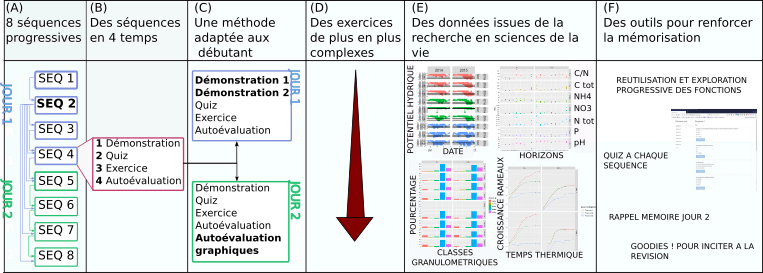
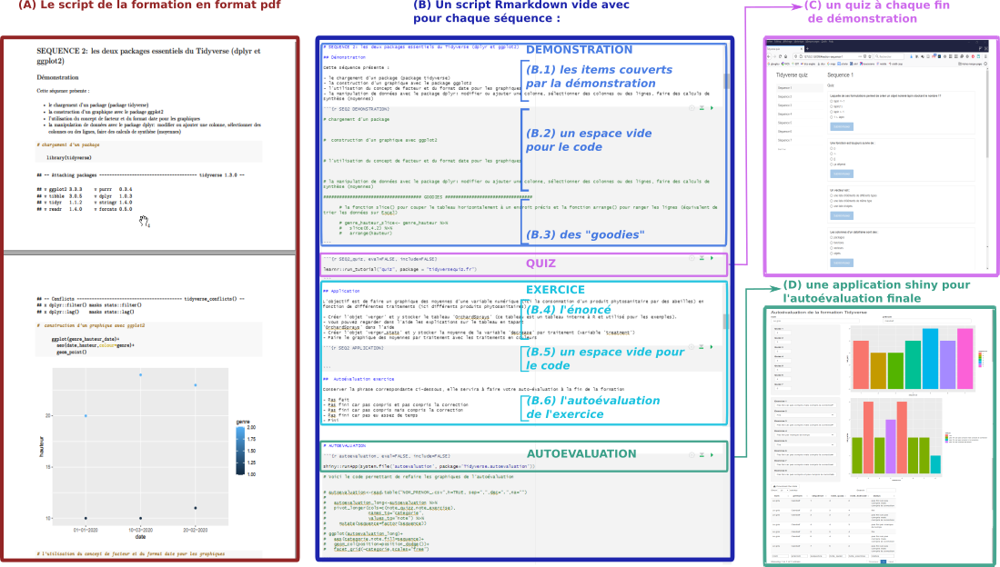

# Méthode pédagogique et architecture de la formation

La formation s’appuie sur une méthode et une progression pédagogique adaptée aux débutant-e-s, et des méthodes basée sur les acquis des sciences cognitives en matière d'apprentissage pour renforcer la mémorisation. Elle utilise également l’interface conviviale de RStudio, qui facilite l’utilisation de R, le format Rmarkdown, qui permet de générer automatiquement des rapports (html,word, pdf ou même des diaporamas) à partir du code, des quiz interactifs générés avec le package learnr et une application interactive pour l'autoévaluation des acquis générée avec le package shiny. Grace à tout cela, vous serez étonnés de ce que vous êtes capables de faire à la fin du deuxième jour!

## Une formation progressive

La formation est conçue de manière progressive afin de renforcer l'acquisition des connaissances (nom et usage des fonctions) et des compétences (remobilisation des fonctions dans un contexte différent, logique des opérations) et ainsi de permettre aux participant-e-s d'être à l'aise avec la syntaxe du Tidyverse et ses fonctions de base. Cette progressivité se retrouve à deux niveaux: 

- la réutilisation et l'exploration progressive des différents usages des fonctions de base présentées en début de formation, du plus simple au plus complexe.
- la complexité croissante des exercices.

## Un fonctionnement en séquences 

La formation est conçue sur la base d'un enchaînement de huit séquences pédagogiques, chaque séquence portant sur une thématique et étant découpée en trois étapes :

- une démonstration, pendant lequel le formateur présente les connaissances et compétences à acquérir en tapant le code correspondant.
- un quiz de 4 à 6 questions conçues pour renforcer la mémorisation et faciliter l'exercice.
- un ou plusieurs exercice(s) permettant de remobiliser dans un contexte différent les connaissances vues pendant la démonstration.

## Une méthode pédagogique adaptée aux débutant-e-s

Les formations aux logiciels informatiques sont classiquement basées sur
le faire ensemble (le formateur montre pas à pas l’enchaînement des
opérations) et les participant-e-s sont alors contraint-e-s d’effectuer
plusieurs tâches simultanément : regarder le tableau pour découvrir les
opérations tapées par le formateur, regarder ensuite son écran pour les
taper, écouter les explications, prendre des notes, corriger ses
erreurs. Ce mélange des tâches entraîne une diminution de la capacité
d’écoute et de compréhension, et en conséquence une diminution de
l’efficacité de l’apprentissage. La méthode pédagogique utilisée ici et
visant à pallier ses problèmes consiste à dédoubler la séquence de démonstration de la manière suivante :

-   

    Une première démonstration, pendant lequel le formateur
    présente les connaissances et compétences à acquérir en tapant le
    code, pendant que les participant-e-s, sans taper le code, concentrent leur attention sur
    la compréhension des informations, les questions et la prise de
    note sur un document pdf à imprimer contenant le code tapé par le formateur (ce qui facilite grandement la prise de notes).

    

-   

    Une deuxième démonstration, pendant lequel le code est
    retapé cette fois-ci tous ensemble, afin que les participant-e-s
    pratiquent et fassent des erreurs corrigées par le formateur.

    

Cette méthode est utilisée le premier jour, et assouplie le/les jour/s
suivant/s, la démonstration ne se faisant ensuite qu’en un seul temps
une fois les participant-e-s à l’aise avec le langage et sa syntaxe.

## Des tableaux de données issus de situations de recherche réelles en agroécologie 

En plus d'être progressifs, les tableaux de données des démonstrations et des exercices sont issus de situations de recherche réelles en agroécologie, permettant une immersion dans la formation plus aisée pour les chercheur-e-s en agroécologie, pour qui cette formation est conçue. 

## Optimiser l'apprentissage avec les sciences cognitives

Enfin, l’utilisation de certains principes d’apprentissage issus des travaux des sciences
cognitives permettent de renforcer l’apprentissage : 

- la préparation en amont de la formation par la lecture du plan détaillé de la formation
envoyé aux participant-e-s
- l’alternance rapprochée de la théorie et de la pratique
- le feedback proche (correction immédiate des quiz et exercices)
- la réactivation mémoire lors des quiz et l'intégration de "goodies"" dans chaque séquence (c'est à dire des fonctions et astuces non couvertes pendant la formation, simplement mentionnées mais écrites dans le document donné aux participant-e-s) que les participant-e-s devront découvrir d'eux-elles mêmes après la formation, afin de les inciter à la réviser pour renforcer la mémorisation.

## Méthode d’autoévaluation

A la fin de la formation, les participant-e-s sont invité-e-s à effectuer leur autoévaluation, qui consiste à produire deux graphiques (et le tableau de synthèse correspondant) présentant leur résultats aux quiz (évaluation de leur effort de mémorisation) et aux exercices (évalaution de leur capacité à remobiliser les connaissances dans des contextes différents), générés automatiquement par une application shiny. Le tableau est alors exportable et le code permettant de générer les graphiques intégré au document rmarkdown de la formation sous forme de goodies.

## Synthèse de la méthode pédagogique

Figure 4: Les points forts de la formation: une formation progressive (réutilisation et exploration progressive des fonctions (A) et exercices de plus en plus longs et complexes (D)), des séquences enchainant théorie/quiz/exercices pour renforcer l'apprentissage (B), une méthode pédagogique adaptées aux débutant-e-s (C), des tableaux issus de situations réelles de recherche en agroécologie (E), et un ensemble de méthodes et outils pour renforcer la mémorisation (F). 

 

## Architecture de la formation

Figure 5: Architecture de la formation présentant les documents utilisés par les participant-e-s: (A) le pdf du script de la formation (hors exercices) à imprimer pour faciliter la prise de note, (B) le modèle Rmarkdown du script de la formation avec les items couverts par chaque démonstration (B.1) repris dans le pdf et dans l'espace vide pour le code (B.2) pour guider l'attention, des "goodies" (B.3) pour inciter à la révision de la formation, les consignes des exercices (B.4), un quiz à ouvrir après chaque démonstration (C) et une application shiny permettant de générer les graphiques de l'autoévaluation et d'exporter le tableau des résultats (D).

 

