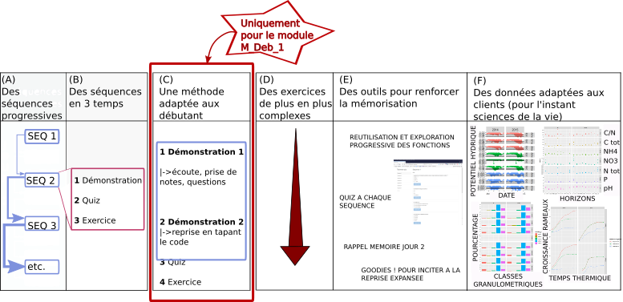

# Méthode pédagogique et architecture de la formation

::: {align="justify"}
Pour tous les modules, la formation utilise l'interface conviviale de
RStudio, qui facilite l'utilisation de R et le format Rmarkdown, qui
permet de générer automatiquement des rapports (html,word, pdf ou même
des diaporamas) à partir du code. Elle utilise également la même méthode
pédagogique qui consiste en un enchainement de séquences progressives
constituées d'un apport théorique, suivi d'un quiz puis d'un exercice et
mobilise des acquis des sciences cognitives en matière d'apprentissage
pour renforcer la mémorisation. Pour le module M_Deb_1, il se rajoute à
cela une méthode pédagogique spécifiquement conçue et éprouvée pour [les
débutant-e-s](#mpd).
:::

## Une formation progressive (fig.4, (A,D))

::: {align="justify"}
La formation est conçue de manière progressive afin de renforcer
l'acquisition des connaissances (nom et usage des fonctions) et des
compétences (remobilisation des fonctions dans un contexte différent,
logique des opérations) et ainsi de permettre aux participant-e-s d'être
à l'aise avec la syntaxe du Tidyverse et ses fonctions de base. Cette
progressivité se retrouve à deux niveaux:

-   la réutilisation et l'exploration progressive des différents usages
    des fonctions de base présentées en début de formation (séquence 2),
    du plus simple au plus complexe.
-   la complexité croissante des exercices.
:::

## Des séquences en trois temps (fig.4, (B))

::: {align="justify"}
La formation est conçue sur la base d'un enchaînement de séquences
pédagogiques, chaque séquence portant sur une thématique et étant
découpée en trois étapes :

-   une démonstration, pendant lequel le formateur présente les
    connaissances et compétences à acquérir en tapant le code
    correspondant.
-   un quiz de 5 questions conçues pour renforcer la mémorisation et
    faciliter l'exercice.
-   un ou plusieurs exercice(s) permettant de remobiliser dans un
    contexte différent les connaissances vues pendant la démonstration.
:::

## Une méthode pédagogique adaptée aux débutant-e-s (fig.4, (C)) {#mpd}

::: {align="justify"}
Les formations aux logiciels informatiques sont classiquement basées sur
le faire ensemble (le formateur montre pas à pas l'enchaînement des
opérations) et les participant-e-s sont alors contraint-e-s d'effectuer
plusieurs tâches simultanément : regarder le tableau pour découvrir les
opérations tapées par le formateur, regarder ensuite son écran pour les
taper, écouter les explications, prendre des notes, corriger ses
erreurs. Ce mélange des tâches entraîne une diminution de la capacité
d'écoute et de compréhension, et en conséquence une diminution de
l'efficacité de l'apprentissage. La méthode pédagogique utilisée ici et
visant à pallier ses problèmes consiste à dédoubler la séquence de
démonstration de la manière suivante :
:::

-   ::: {align="justify"}
    Une première démonstration, pendant lequel le formateur présente les
    connaissances et compétences à acquérir en tapant le code, pendant
    que les participant-e-s, sans taper le code, concentrent leur
    attention sur la compréhension des informations, les questions et la
    prise de note sur le document pdf envoyé en amont et à imprimer et
    contenant le code tapé par le formateur (ce qui facilite grandement
    la prise de notes).
    :::

-   ::: {align="justify"}
    Une deuxième démonstration, pendant lequel le code est retapé cette
    fois-ci tous ensemble, afin que les participant-e-s pratiquent et
    fassent des erreurs corrigées par le formateur.
    :::

::: {align="justify"}
Cette méthode est utilisée le premier jour, et assouplie le/les jour/s
suivant/s, la démonstration ne se faisant ensuite qu'en un seul temps
une fois les participant-e-s à l'aise avec le langage et sa syntaxe.
:::

## Optimiser l'apprentissage avec les sciences cognitives (fig.4, (E))

::: {align="justify"}
Enfin, l'utilisation de certains principes d'apprentissage issus des
travaux des sciences cognitives permettent de renforcer l'apprentissage
:

-   La préparation en amont de la formation par la lecture du plan
    détaillé de la formation envoyé aux participant-e-s
-   La mise en application systématique et immédiate après chaque apport
    théorique
-   Le feedback proche (correction immédiate des quiz et exercices)
-   La réactivation mémoire (i) lors des quiz, (ii) lors de l'exercice
    de lecture de code en ouverture du module M_deb_2, qui permet de
    réviser les fonctions de base du M_deb_1, (iii) la cartographie des
    connaissances acquises en fin des modules M_deb_2, M_inter et
    M_conf, et (iv) l'incitation à la reprise expansée de chaque module
    (idéalement une semaine après le module) par l'intégration de
    "goodies" dans chaque séquence, qui sont des fonctions et astuces
    mentionnées mais non couvertes pendant la formation et que les
    participant-e-s devront découvrir d'eux-elles mêmes après la
    formation, afin de les inciter à la réviser pour renforcer la
    mémorisation.
:::

## Des tableaux de données issus de situations de recherche réelles (fig.4, (F))

::: {align="justify"}
Les tableaux de données des démonstrations et des exercices sont issus
de situations de recherche réelles en sciences expérimentales,
permettant une immersion dans la formation plus aisée pour les
chercheur-e-s en sciences expérimentales. Pour l'instant les tableaux de
données sont issus de recherches en sciences de la vie (agronomie et
écologie), mais il est prévu de pouvoir adapter les tableaux de données
aux client-e-s (par exemple avec des tableaux plus adaptés aux sciences
humaines et sociales).
:::

## Synthèse de la méthode pédagogique

Figure 4: Synthèse de la méthode pédagogique : (A) une formation
progressive (réutilisation et exploration progressive des fonctions et
(D) exercices de plus en plus longs et complexes ), (B) des séquences
enchainant théorie/quiz/exercices pour renforcer l'apprentissage, (C)
une méthode pédagogique adaptées aux débutant-e-s, (E) un ensemble de
méthodes et outils pour renforcer la mémorisation et (F) des tableaux
issus de situations réelles de recherche en sciences expérimentales.

 

## Méthode d'évaluation de l'atteinte des objectifs

::: {align="justify"}
A la fin de la formation, les participant-e-s sont invité-e-s à
effectuer leur autoévaluation, qui consiste à produire deux graphiques
(et le tableau de synthèse correspondant) présentant leur résultats aux
quiz (évaluation de leur effort de mémorisation) et aux exercices
(évaluation de leur capacité à remobiliser les connaissances dans des
contextes différents), générés automatiquement par une application shiny
(RStudio, package shiny). Le tableau est alors exportable et le code
permettant de générer les graphiques intégré au document rmarkdown de la
formation.
:::

## Architecture

Pour chaque module, la formation repose sur 4 documents utilisés par les
participant-e-s (fig. 5):

-   Le pdf du script de la formation (hors exercices) à imprimer pour
    faciliter la prise de note
-   Le modèle Rmarkdown du script de la formation
-   Un quiz à ouvrir après chaque démonstration (RStudio, package
    learnr)
-   Une application shiny (RStudio, package shiny) permettant de générer
    les graphiques de l'autoévaluation et d'exporter le tableau des
    résultats

Figure 5: Architecture de la formation présentant les documents utilisés
par les participant-e-s: (A) le pdf du script de la formation (hors
exercices) à imprimer pour faciliter la prise de note, (B) le modèle
Rmarkdown du script de la formation avec les items couverts par chaque
démonstration (B.1) repris dans le pdf et dans l'espace vide pour le
code (B.2) pour guider l'attention, des "goodies" (B.3) pour inciter à
la révision de la formation, les consignes des exercices (B.4), un quiz
à ouvrir après chaque démonstration (C) et une application shiny
permettant de générer les graphiques de l'autoévaluation et d'exporter
le tableau des résultats (D).

 
